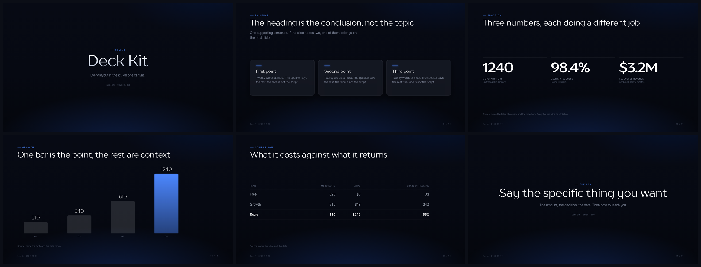

# deck-kit

Build a pitch deck as code, from one shared kit, so it comes out brand-exact,
reviewable in git, and identical on a laptop, a 4K monitor and a boardroom
projector.



Three things that work together:

- **the kit** (`kit/`) — reveal.js underneath, one stylesheet for layout and
  motion, three themes for colour and type, a small runtime, the fonts
- **the tool** (`bin/deck.sh`) — scaffold a deck, screenshot every slide,
  export a PDF, list what exists
- **the skill** (`skills/building-a-pitch-deck/`) — the judgement: which
  narrative fits which room, what makes a slide read as expensive, and the pass
  to run before sending anything

## Use it

Ask Claude for a deck and the skill fires on its own. `/deck-kit:deck` starts
one explicitly. Or drive the tool yourself, from any project:

```bash
deck.sh new acme-series-a --kind investor --title "Acme" --presenter "Your Name"
deck.sh shots acme-series-a    # one PNG per slide, into dist/shots
deck.sh build acme-series-a    # the PDF and the cover
deck.sh list
```

Decks land in `./decks/` in whatever project you are in. The first one there
also copies the engine into `./decks/_kit`, so your decks keep working if this
plugin is updated or removed, and still open in five years on a laptop with
nothing installed.

While presenting: arrows to move, `Esc` for the overview, `G` to overlay the
12-column grid when a slide feels subtly wrong.

`DECKS_DIR` keeps decks somewhere else, `DECK_KIT` points at another copy of
the engine, `CHROME_BIN` chooses the browser.

## Where to start editing

`example/index.html` is every layout the kit has, worked, each with a comment
saying when to use it. Copy from there rather than inventing markup. Anything
true of only your deck goes in its own `deck.css`.

## Themes

`notify-me-dark` (the default), `notify-me-light` for a deck that will mostly
be read as a PDF, and `neutral` for anything that is not Notify Me. A theme
sets custom properties and nothing else. To point the kit at another brand,
copy `neutral.css`, change `--accent` and the two font stacks, and leave the
rest of the kit alone.

## Requirements

Bash, Python 3 with Pillow (`pip install pillow`), and a Chromium. The tool
finds Chrome or Chromium automatically.

**Not the snap build of Chromium.** It is confined: it writes its output inside
its own private `/tmp` and reports success while producing no file, which looks
exactly like a bug in this tool. Any other Chromium, including the one
Playwright installs, is fine.

## Why the PDF is raster

It is assembled from one capture per slide rather than from the browser's print
pipeline. reveal.js 5 owns that pipeline and its paper stylesheet unpins
absolutely positioned slides; measured 2026-09-03, both `chromium
--print-to-pdf` and a CDP `Page.printToPDF` with an explicit 1920x1080 paper
size returned two blank pages regardless of deck length. Capturing frames costs
selectable text and buys an exact match with what the room saw.

## Fonts

Read `FONTS.md` before this repository is made public or sent outside the
company. TT Drugs is commercial.
